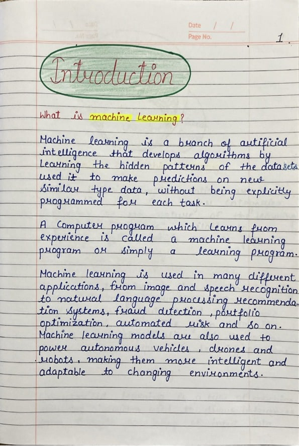

# 📝 Handwriting to Text App

A Streamlit web app that extracts text from handwritten images using EasyOCR.

## 💡 Features
- Upload handwritten notes
- AI-based OCR to extract text
- Simple and fast web interface

## 🚀 How to Run
1. Clone the repo
2. Install requirements: `pip install -r requirements.txt`
3. Run the app: `streamlit run app.py`

## 🛠 Tech Stack
- Python
- Streamlit
- EasyOCR
- PIL
- NumPy

## ✨ Output

